# Heimdall

## Test Reporting Tool

Heimdall is a Test Reporting Tool which is primarily built to publish your test execution results to the google sheets from
 
    a.Server(like Jenkins) 
    b.Local 
  
and notifies the recipients through the Communication channels (like Slack). This tool helps the recipients/users to know the current status of their products by executing the test cases just on a button click. Helps the recipients/users to make decisions for release instantaneously  and brings the transparency between your product and it's state.

### **Requirements**
1. Testcases ticket in Jira (we don’t support any other tool as of now)
2. Mobility Stream jira plugin (Helps to  Export Test cases to a Google Sheet and  maintain Realtime sync with Jira. You can use jira cloud plugin as well )
3. An Exported Test Cases Google sheet from the Mobility Stream Plugin (Acts as a source of Test Cases)
4. An Imported Google sheet (using Importrange) from sheet Generated in step(3) (Acts as a source to operate Heimdall )
5. Amazon s3 Account (Push the Test Execution Results)
6. Jenkins Job (Execute Test cases in Real Time)
7. Maven Automation projects (like cucumber/Karate for UI/API)
8. Tagged scenario's with feature files (Helps to Generate Reports at Tag level)

## **Steps to Set-up**
### **Phase: 1 : Setting Up Test Cases From Jira to Google Spreadsheet**

You can export test cases on google sheet via any tool you prefer. We use mobility stream plugin for realtime update. Check 

### **Phase: 2 : Setting Up Jenkins Job Configurations and Heimdall Add-on**
1. Create a Jenkins job with the same name as your google sheet name which acts as a source to execute Heimdall (e.g: **project-tmt-test** is the Sheet name as well as the Jenkins job name).
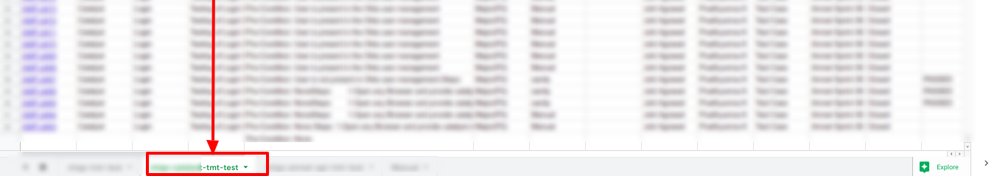

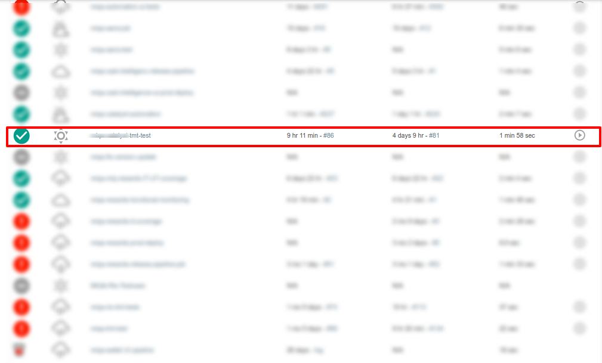

**Note**: User can Have multiple sheets and corresponding Jenkins jobs for all the services you have.

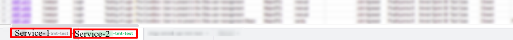

#### **Setting-up Add-on for the Imported Google Sheet**
Click on the link: https://chrome.google.com/webstore/detail/heimdal/nicbooiejimgejoiccgbnibcaaocaibn?utm_source=permalink and click on the free option on the upper right corner of the

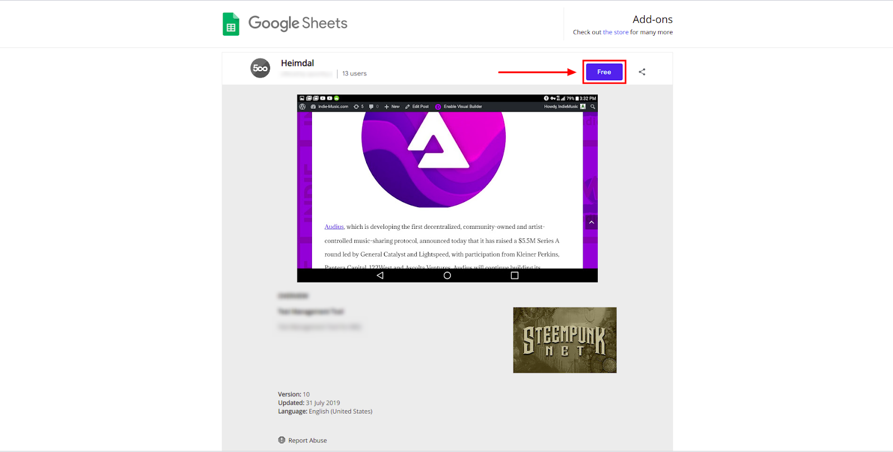

##### **To Get Jenkins Token :**
Open your jenkins → click on your Profile → Configure → Add New Token → Copy the Token

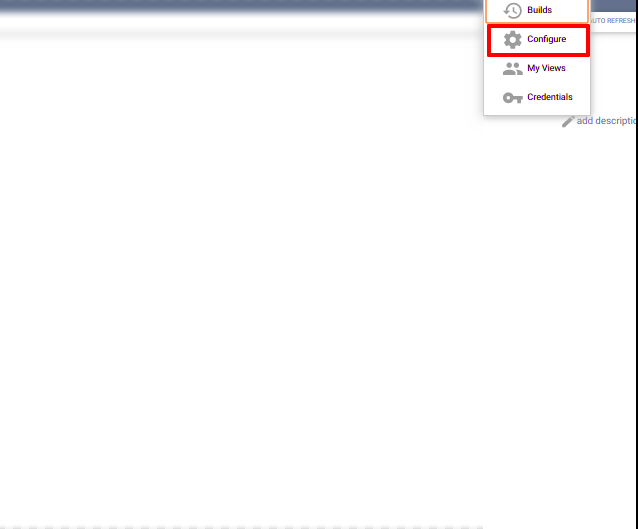

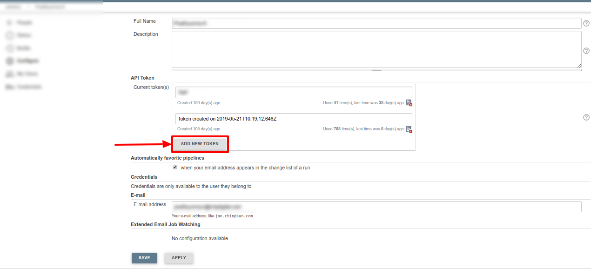

#### **To configure the heimdall Add-On in the imported google sheet :**
 Select the Add-ons menu from the google sheet → Heimdall → Configurations and provide below details
1. Jenkins Token name as your mail-id
2. Jenkins Token-id (Obtained Above)
3. Jenkins domain name as "your Jenkins Home Page URL"
4. Jenkins Job category
5. s3 Access key
6. s3 Secret key

Click on save, a pop-up box will be displayed mentioning that the configuration values are set

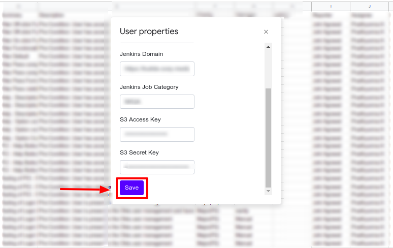

#### Heimdall Add-on Features

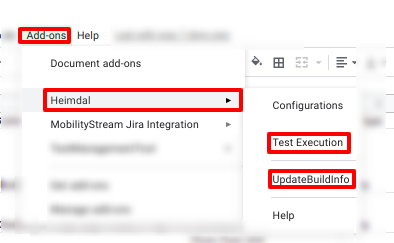

###### **Test Executions**

An alert message will pop-up saying Jenkins Job Triggered and you can see that Jenkins will be triggered. If there is an error in between the flow, an alert message will pop-up with the corresponding message populated.
Note: Main Cause for error could be the wrong Configurations provide by User in Heimdall add-on.

###### **Update Build Info**

1. Click on Add-ons → Heimdall(Hover on it) → Click on Update Build Info.
Google sheet will be updated with the Build data (The data for the builds which are not available previously in the sheet will be updated)

    Note: 
     Make sure you have the Build Information Stored in your Amazon s3 location for each build.
     Build Passed/Failed: 
     When there is no build running in Jenkins and you select update build info all the information of the latest builds ( builds previously not present in the sheet) gets updated
     Build is in Progress:
     When the execution of Jenkins job is still in progress. 
     All the build info until the latest executing build gets updated and you will be notified that the job for the latest build is still in progress. (Ex. Your sheet has info till build 34 and you trigger build 37. The data of build 35 and 36 gets updated in the sheet and the message as shown below gets displayed for build 37)

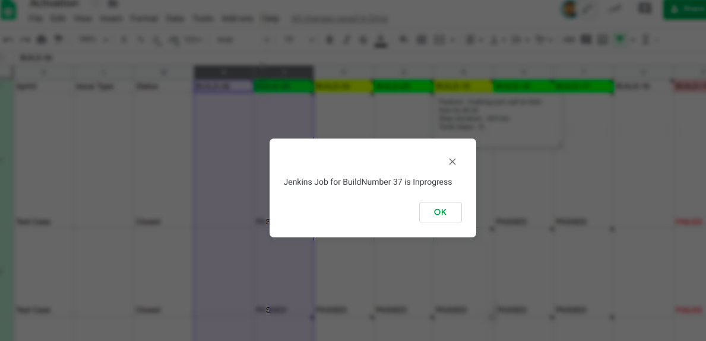

#### Colour Format and the Comments

1. Build number with Green color : If all the test cases gets passed then the build number cell on the top will be set to green color.
2. Build number with Pink color : If the number of failed test cases are greater than the passed test cases , the build number cell will be set to pink color.
3. Build number with Red color : If all the test cases gets failed the build number cell will be set to red color.
4. Build number with Yellow color : If the number of passed test cases are greater than the passed test cases , the build number cell will be set to yellow color.
5. Build number with no color : The cell will have no color when there is no test result in S3.  
6. When the sheet is updated with all the recent build information : When the sheet has all the recent build data and if updateBuild Info option is selected, alert message  is displayed informing that the sheet is up-to date.

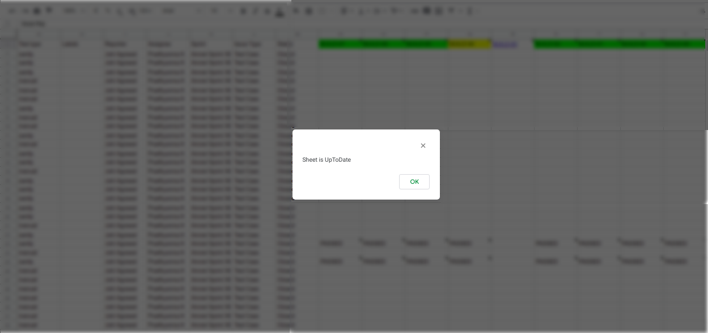

#### Execution Details
Comment appears on each Field where User can see the corresponding Details of their corresponding Build information, where each passed /failed status shown provides the feature details, numbers of steps executed and the number of duration taken to execute the Test case.

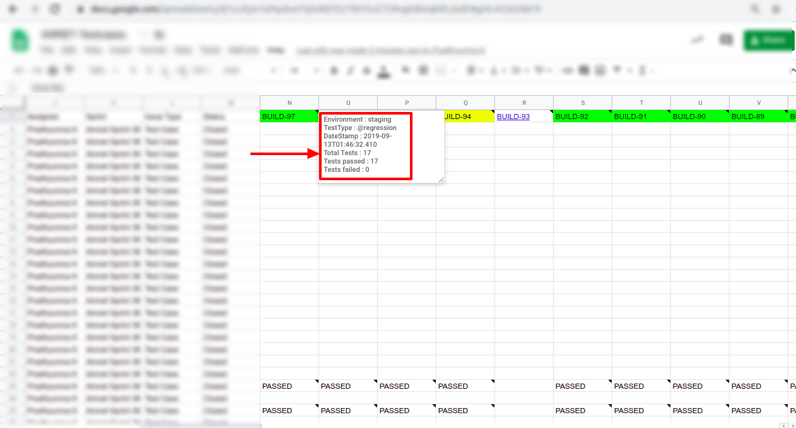