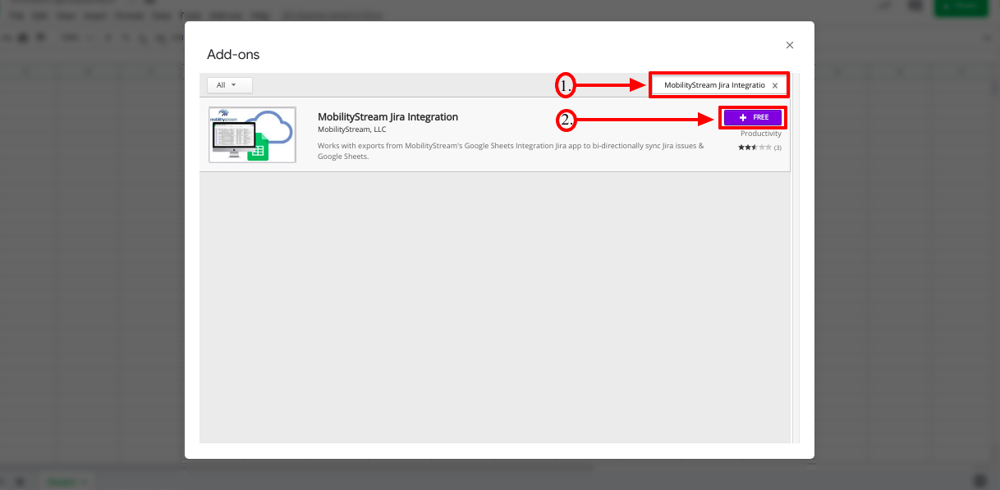
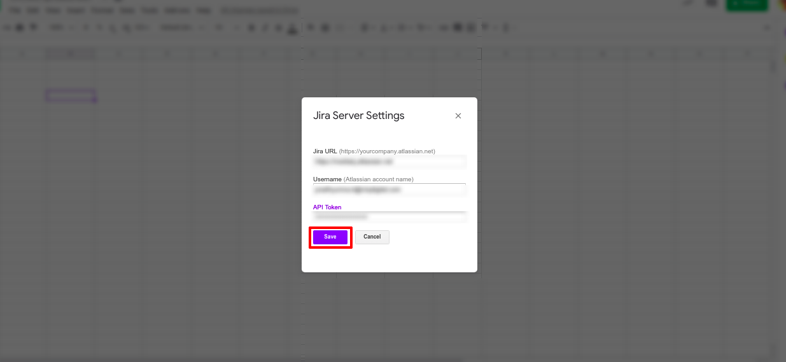
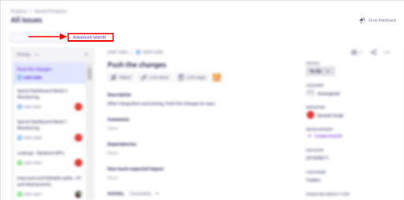
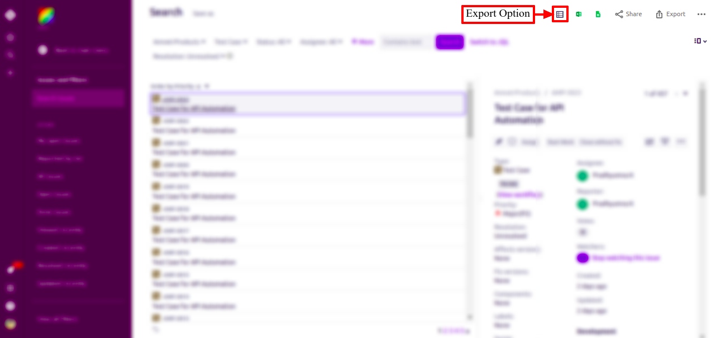
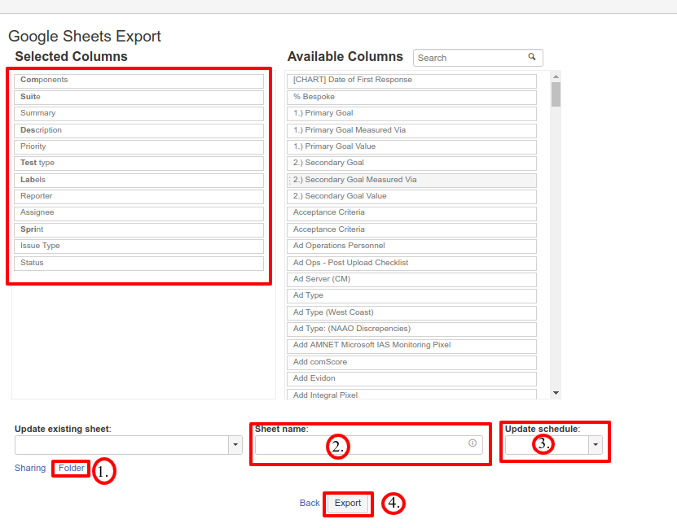

## Steps to set up Real-Time update of Google sheet ## 

1. Open Google spreadsheets with your Google Account

2. Click on Blank Page → Add-ons → Get add-ons → Search for MobilityStream Jira Integration Plug-in and install

3. Click on Add-ons→ MobilityStream Jira Integration(Hover on it)→ Click on settings.

     - Input Jira URL: https://yourcompany.atlassian.net
     - Input Username: Your Company's google account.
     - Generate API Token Using this link : https://id.atlassian.com/manage/api-tokens
     - Input the API Token got in the previous step and click on save.  
     
      

4. Open your Jira Dashboard → Click on Issues and Filters→ Click on Advanced search → Select type as a Test case

 

 

8. Click on Google sheets Export on the top right corner( If Pop-up is blocked open the pop-up)

9. Select the Following Columns

10. Click on the folder(Bottom left corner)→ Select Your Drive Folder→ Input Sheet name as (Team-name)-Testcase→ Input Update schedule as Real Time

11. 

12. A sheet will be Generated which has the corresponding columns as selected in the above figure

13. Create another blank Google sheet and import the Google sheet that is Generated in the step(8)   Example: =IMPORTRANGE("Google sheet link (created in step 8)","Data!A:M") Here A and M refers to the first and last column index of the google sheet created in step (11)","Data!A:M") Here A and M refers to the first and last column index of the google sheet created in step (8) 